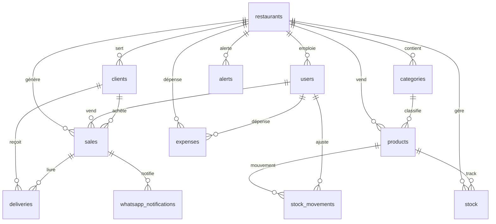

# Documentation Schéma PostgreSQL - Restaurant Gout Divin

## Vue d'ensemble

Schéma de base de données complet pour un système de gestion de restaurant, optimisé pour PostgreSQL avec Supabase.

## Architecture des Tables

### Tables Principales

#### 1. `restaurants`
- **Rôle** : Établissement(s) géré(s)
- **Champs clés** : id (UUID), name, address, phone, email, settings (JSONB)
- **Relations** : Table parent pour toutes les autres tables

#### 2. `users`
- **Rôle** : Personnel du restaurant
- **Rôles possibles** : gerant, caissier, cuisinier, livreur
- **Champs clés** : id, restaurant_id, name, email, password, role, is_active
- **Sécurité** : Mot de passe hashé, authentification JWT

#### 3. `categories`
- **Rôle** : Classification des produits
- **Champs clés** : id, restaurant_id, name, color, order_index
- **Usage** : Organisation du menu par catégories

#### 4. `products`
- **Rôle** : Articles du menu
- **Champs clés** : id, restaurant_id, category_id, name, description, price, cost_price, is_available
- **Calculs** : Marge bénéficiaire = price - cost_price

#### 5. `stock`
- **Rôle** : Gestion des inventaires
- **Champs clés** : id, restaurant_id, product_id, quantity, min_quantity, unit
- **Alertes** : Déclenche alertes si quantity <= min_quantity

#### 6. `stock_movements`
- **Rôle** : Historique des mouvements de stock
- **Types** : 'in' (entrée), 'out' (sortie), 'adjustment' (ajustement)
- **Traçabilité** : Qui, quoi, quand, pourquoi

#### 7. `clients`
- **Rôle** : Gestion de la clientèle
- **Champs clés** : id, restaurant_id, name, phone, email, address, loyalty_points, total_spent
- **Fidélité** : Points accumulés automatiquement

#### 8. `sales`
- **Rôle** : Transactions et ventes
- **Champs clés** : id, restaurant_id, user_id, client_id, items (JSONB), total_amount, payment_method, status
- **Items** : Structure JSONB avec détails des produits vendus

#### 9. `deliveries`
- **Rôle** : Gestion des livraisons
- **Champs clés** : id, restaurant_id, sale_id, client_id, delivery_address, status, delivery_fee
- **Statuts** : pending, preparing, ready, delivering, delivered, cancelled

#### 10. `expenses`
- **Rôle** : Suivi des dépenses
- **Champs clés** : id, restaurant_id, category, amount, description, expense_date, receipt_url
- **Catégories** : Loyer, salaires, achats, utilities, etc.

#### 11. `alerts`
- **Rôle** : Notifications système
- **Types** : stock_low, expense_high, client_loyalty, system
- **Sévérité** : low, medium, high

#### 12. `whatsapp_notifications`
- **Rôle** : Notifications WhatsApp (via Twilio)
- **Champs clés** : id, restaurant_id, recipient_phone, message, status, twilio_sid

## Relations Entre Tables

## Fonctions SQL Automatisées

### 1. `decrement_stock(item_id, qty)`
- **Usage** : Réduit le stock lors des ventes
- **Déclenchement** : Trigger sur ventes

### 2. `increment_stock(item_id, qty)`
- **Usage** : Augmente le stock (réceptions, retours)
- **Déclenchement** : Manuel ou automatique

### 3. `update_client_total_spent(client_uuid, amount)`
- **Usage** : Met à jour le total dépensé par un client
- **Déclenchement** : Trigger après chaque vente

### 4. `update_loyalty_points(client_uuid, amount)`
- **Usage** : Calcule et ajoute les points de fidélité
- **Règle** : 1 point par 1000 FCFA dépensés

## Triggers Automatiques

### 1. `update_client_on_sale`
- **Déclenchement** : Après insertion dans `sales`
- **Actions** : 
  - Met à jour `total_spent` du client
  - Calcule et ajoute les points de fidélité
  - Met à jour `updated_at` du client

### 2. `update_updated_at_column`
- **Déclenchement** : Avant UPDATE sur tables pertinentes
- **Action** : Met à jour automatiquement le timestamp

## Vues de Statistiques

### 1. `dashboard_stats`
- **Usage** : Tableau de bord principal
- **Métriques** : Ventes totales, revenus, clients, stock bas, ventes du jour/semaine/mois

### 2. `top_products`
- **Usage** : Produits les plus populaires
- **Métriques** : Nombre de ventes, revenus générés

### 3. `loyal_customers`
- **Usage** : Meilleurs clients
- **Métriques** : Points de fidélité, total dépensé, nombre de commandes

## Sécurité (Row Level Security)

### Politiques RLS Actives
- **Principe** : Chaque restaurant ne voit que ses propres données
- **Tables protégées** : Toutes les tables sauf `restaurants`
- **Authentification** : Basée sur JWT avec `restaurant_id`

### Rôles et Permissions
- **gerant** : Accès complet à toutes les fonctionnalités
- **caissier** : Ventes, gestion clients, consultation stock
- **cuisinier** : Consultation commandes, gestion stock ingrédients
- **livreur** : Gestion des livraisons assignées

## Index Optimisés

### Performance
- **Recherches rapides** : Index sur clés étrangères et champs fréquemment queryés
- **Jointures optimisées** : Index sur `restaurant_id` pour toutes les tables
- **Filtres temporels** : Index sur `created_at` pour les ventes

### Index Principaux
- `users_restaurant_id`, `sales_restaurant_id`, `sales_created_at`
- `clients_phone`, `stock_product_id`, `deliveries_status`
- `products_category_id`, `expenses_expense_date`

## Types de Données Spécifiques

### JSONB Usage
- **sales.items** : Détails des produits vendus avec quantités et prix
- **restaurants.settings** : Configuration spécifique au restaurant
- **alerts.data** : Métadonnées additionnelles pour les alertes

### Formats Monétaires
- **DECIMAL(10,2)** : Précision pour les montants financiers
- **Validation** : CHECK constraints pour éviter les valeurs négatives

### Timestamps
- **TIMESTAMP WITH TIME ZONE** : Gestion cohérente des fuseaux horaires
- **DEFAULT NOW()** : Horodatage automatique

## Données de Test

### Restaurant Togo
- **Nom** : Restaurant Gout Divin
- **Localisation** : Lomé, Togo
- **Téléphone** : +228 90 00 00 00

### Produits Locaux
- **Plats** : Riz sauce arachide, Poulet braisé, Attiéké poisson
- **Boissons** : Soda, Eau minérale
- **Prix** : Adaptés au marché togolais (300-2500 FCFA)

### Utilisateurs Test
- **Manager** : Vianney Manager
- **Caissier** : Caissier Principal
- **Rôles** : Configurés pour démonstration

## Maintenance et Évolution

### Sauvegardes
- **Fréquence** : Quotidienne pour les données critiques
- **Rétention** : 30 jours pour les transactions, 1 an pour les clients

### Performance
- **Monitoring** : Requêtes lentes, taille des tables
- **Optimisation** : Réindexation périodique, vacuum

### Évolutivité
- **Multi-restaurants** : Architecture déjà prête
- **Extensions** : Tables modulaires pour nouvelles fonctionnalités
- **API** : Endpoints RESTful déjà configurés
